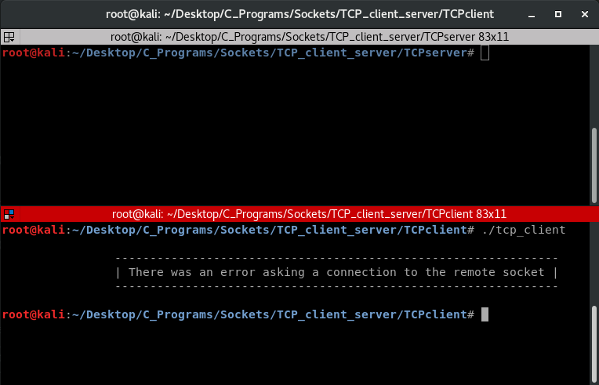
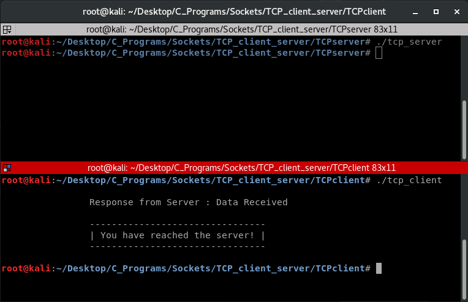

# TCP_CLient_Server
This repo contains TCP/IP client and TCP/IP server written in c using sockets   

# Installation
just downaload the zip or clone using
```ruby
https://github.com/AwesomeChap/TCP_Client_Server.git
```
# Usage   
Navigate to /HTTPserver and open terminal and type
```ruby
gcc TCPserver.c -o tcp_server
./tcp_server
```   
Navigate to /HTTPclient and open another terminal and type
```ruby
gcc TCPclient.c -o tcp_client
./tcp_client
```   
# Demo   

<b>Before server started</b>
  


<b>After server started</b>
 
